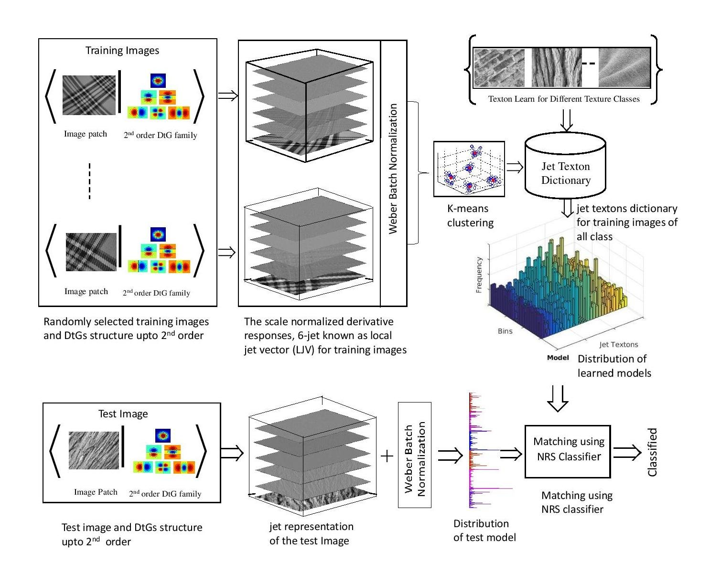

# Unconstrained Texture Classification Using Efficient Jet Texton Learning

## Description

This work proposes a simple and effective texture recognition method that uses a new class of jet texton learning. In this approach, first a Jet space representation of the image is derived from a set of derivative of Gaussian (DtGs) filter responses upto 2nd order (R^6), so called local jet vector (LJV), which satisfies the scale space properties, where the combinations of local jets preserve the intrinsic local structure of the image in a hierarchical way and are invariant to image translation, rotation and scaling. Next, the jet textons dictionary is learned using K-means clustering algorithm from DtGs responses, followed by a contrast Weber law normalization pre-processing step. Finally, the feature distribution of jet texton is considered as a model which is utilized to classify texture using a non-parametric nearest regularized subspace (NRS) classifier.

## Model

## Citation

If you use this code in your research, we would appreciate a citation to the original paper:

	@article{roy2019jettexton,
            title={Unconstrained Texture Classification Using Efficient Jet Texton Learning},
            author={Roy, Swalpa Kumar and Ghosh, Dipak and Dubey, Shiv Ram and bhattacharyya, sidhartha and Chaudhuri, Bidyut B},
            journal={In Journal of Applied Soft Computing-Elsevier},
            year={2019}
            }
